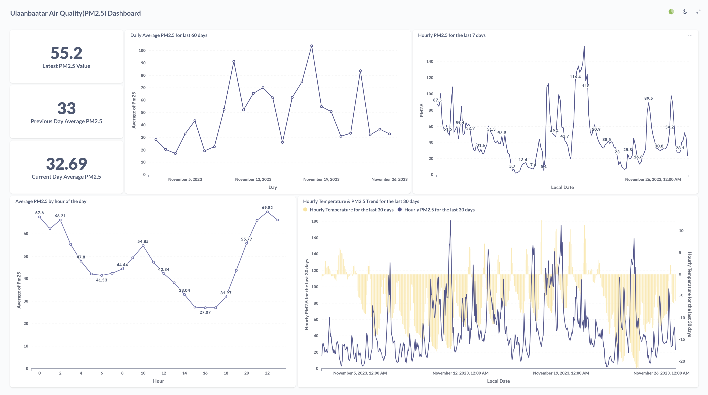
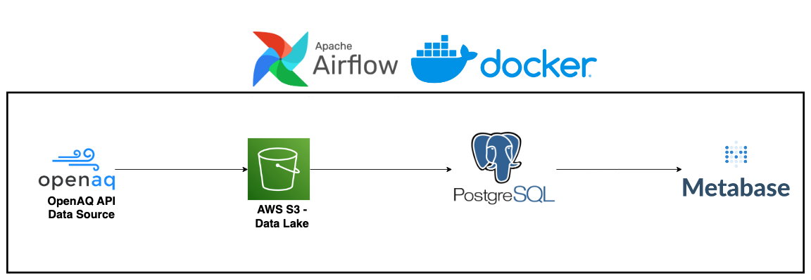

# Table of Contents 
1. [Introduction](README.md#introduction)
2. [Pipeline](README.md#pipeline)
3. [Requirements](README.md#requirements)
4. [Run Instructions](README.md#Run%Instructions)


# Introduction

This project builds a simple air quality data dashboard using end-to-end data pipeline. There are 3 main componenets: data storage by AWS S3 and PostgreSQL, orchestration by Airflow, and dashboard rendering by Metabase. 



There are easier and simpler methods to achieve the end result but the aim of this project is to focus on learning and practicing these various tools.

# Pipeline



- Python code to extract air quality data from [OpenAQ API](https://docs.openaq.org/docs)
- Upload the extracted data to AWS S3 bucket (Data Lake)
- Ingest the data to PostgreSQL database and clean it (Data Warehouse)
- Create a dashboard in Metabase using PostgreSQL data.
- Orchestrated by Airflow


# Requirements

- [Docker](https://docs.docker.com/desktop/)
- [Docker Compose](https://docs.docker.com/compose/)
- [PostgreSQL](https://www.postgresql.org/docs/13/)
- [Metabase](https://www.metabase.com/)
- [AWS](https://aws.amazon.com/)

# Run Instructions

- Create a virtual environment and ```pip install -r requirements.txt```
- Set up OpenAQ API key, S3 bucket, and IAM role. Define OPENAQ_API_KEY in .env file.
- Run ```docker-compose up -d``` to start the Docker containers.
- Once the containers are up and running, open the Airflow UI to run the DAG, and set up AWS and PostgreSQL connections.


